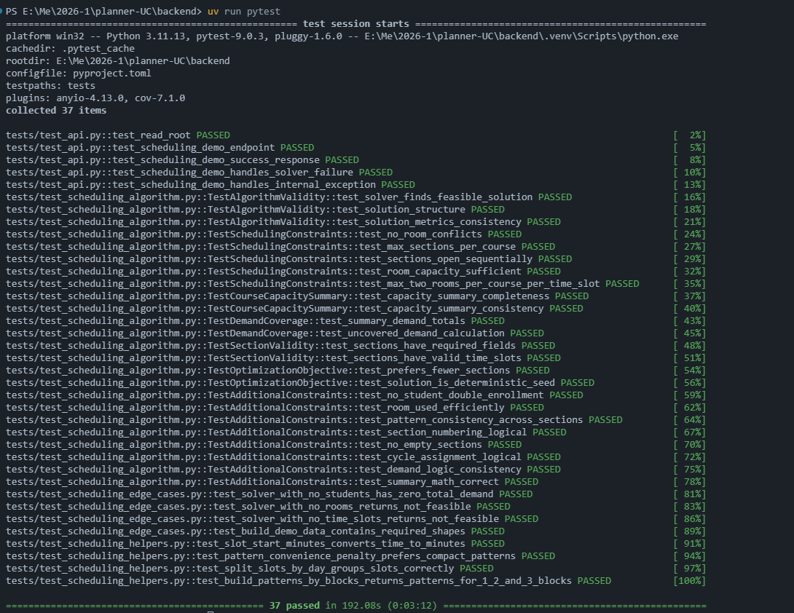
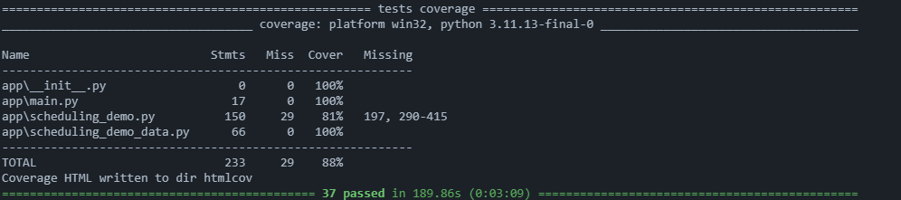

# Documento Resumen de Testing Backend

## 1. Objetivo

Este documento resume la estrategia de pruebas implementada en el `backend` de `Planner-UC`, los módulos cubiertos, los resultados obtenidos y la forma de ejecutar las pruebas.

El backend del proyecto está construido con:

- `FastAPI`
- `Python`
- `OR-Tools CP-SAT`

La estrategia de pruebas se adaptó al stack real del proyecto usando herramientas nativas de Python, manteniendo la estructura ya existente del repositorio.

## 2. Herramientas utilizadas

Se utilizaron las siguientes herramientas:

- `pytest` como runner principal
- `FastAPI TestClient` para pruebas de integración de API
- `pytest-cov` para medición de cobertura

Archivos de referencia principales:

- [backend/pyproject.toml](/e:/Me/2026-1/planner-UC/backend/pyproject.toml)
- [backend/app/main.py](/e:/Me/2026-1/planner-UC/backend/app/main.py)
- [backend/app/scheduling_demo.py](/e:/Me/2026-1/planner-UC/backend/app/scheduling_demo.py)
- [backend/app/scheduling_demo_data.py](/e:/Me/2026-1/planner-UC/backend/app/scheduling_demo_data.py)

## 3. Qué se implementó

Se trabajó sobre la base de pruebas que ya existía y se reforzó con pruebas unitarias, pruebas de integración API y casos límite del solver.

### 3.1 API cubierta

Se probaron los endpoints actuales del backend:

- `GET /`
- `GET /api/scheduling-demo`

Escenarios cubiertos:

- respuesta exitosa del endpoint raíz
- respuesta válida del endpoint del solver
- estructura correcta del JSON
- caso de fallo lógico del solver (`success: false`)
- caso de excepción interna controlada con respuesta `500`

### 3.2 Solver y lógica de negocio cubiertos

Se validaron reglas importantes del algoritmo:

- existencia de solución factible
- consistencia del resumen
- ausencia de conflictos de aula
- límite de secciones por curso
- apertura secuencial de secciones
- capacidad suficiente o demanda no cubierta consistente
- consistencia del resumen de capacidad
- consistencia de la demanda total
- validez de slots y secciones
- consistencia matemática del resultado

### 3.3 Helpers y utilitarios cubiertos

Se añadieron pruebas unitarias para:

- `_slot_start_minutes()`
- `_pattern_convenience_penalty()`
- `_split_slots_by_day()`
- `_build_patterns_by_blocks()`

Esto permitió cubrir lógica aislada y no solo pruebas de extremo a extremo del solver.

### 3.4 Edge cases cubiertos

Se añadieron pruebas para casos límite del solver:

- sin estudiantes
- sin aulas
- sin time slots
- validación de la estructura base de `build_demo_data()`

Además, se reforzó el solver para que cuando no existan candidatos de sección no rompa con excepción interna, sino que devuelva una respuesta controlada de no factibilidad.

## 4. Resultados de ejecución

Resultado de ejecución de tests:

- `37` tests aprobados
- `0` fallos

Comando usado:

```powershell
cd backend
uv run pytest
```

Resultado de cobertura:

- cobertura total backend: `88%`

Comando usado:

```powershell
cd backend
uv run pytest --cov=app --cov-report=term-missing --cov-report=html
```

## 5. Cobertura obtenida

Cobertura por archivo:

- `app/main.py`: `100%`
- `app/scheduling_demo_data.py`: `100%`
- `app/scheduling_demo.py`: `81%`
- total backend: `88%`

## 6. Adaptación de herramientas

Aunque la consigna original menciona herramientas pensadas para stacks JavaScript, el backend de este proyecto no está hecho en Node sino en `Python + FastAPI`.

Por eso, la adaptación técnica correcta fue:

- `pytest` en lugar de `Jest/Vitest`
- `FastAPI TestClient` para integración API
- `pytest-cov` para cobertura

Esta decisión es coherente con el stack real del proyecto y con buenas prácticas de testing en aplicaciones Python.

## 7. Qué quedó más fuerte

Las áreas mejor cubiertas del backend son:

- endpoint del scheduling
- manejo de errores del endpoint
- construcción de patrones horarios
- penalizaciones y helpers internos
- consistencia del resumen del solver
- restricciones críticas de aulas, secciones y demanda

## 8. Qué podría mejorarse después

Todavía se podría ampliar en el futuro:

- más pruebas sobre ramas internas de `scheduling_demo.py`
- más datasets alternativos para el solver
- pruebas adicionales sobre tiempos extremos o configuraciones más pequeñas

## 9. Evidencias disponibles

Comandos ejecutados:

```powershell
cd backend
uv run pytest
```

```powershell
cd backend
uv run pytest --cov=app --cov-report=term-missing --cov-report=html
```

Capturas incorporadas:

- evidencia de ejecución de pruebas: [test.png](./test.png)
- evidencia de cobertura: [coverage.png](./coverage.png)

### 9.1 Evidencia visual de ejecución



### 9.2 Evidencia visual de cobertura



Reportes generados:

- consola de `pytest`
- consola de `pytest-cov`
- reporte HTML en `backend/htmlcov`

## 10. Cómo correr el testing backend

### 10.1 Ejecutar tests

```powershell
cd backend
uv run pytest
```

### 10.2 Ejecutar cobertura

```powershell
cd backend
uv run pytest --cov=app --cov-report=term-missing --cov-report=html
```

Ubicación del reporte HTML:

- `backend/htmlcov/index.html`

## 11. Conclusión

La estrategia de testing backend quedó fortalecida sobre la estructura original del proyecto y ahora cubre tanto integración API como lógica interna del solver.

Resultados finales:

- `37` tests aprobados
- `88%` de cobertura total
- manejo controlado de errores
- validación de restricciones críticas y edge cases

Conclusión final:

- el `backend` ya cuenta con pruebas unitarias, integración API, edge cases y cobertura documentada
- el flujo de ejecución quedó claro y reproducible desde comandos simples
