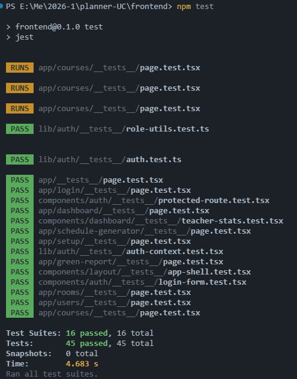
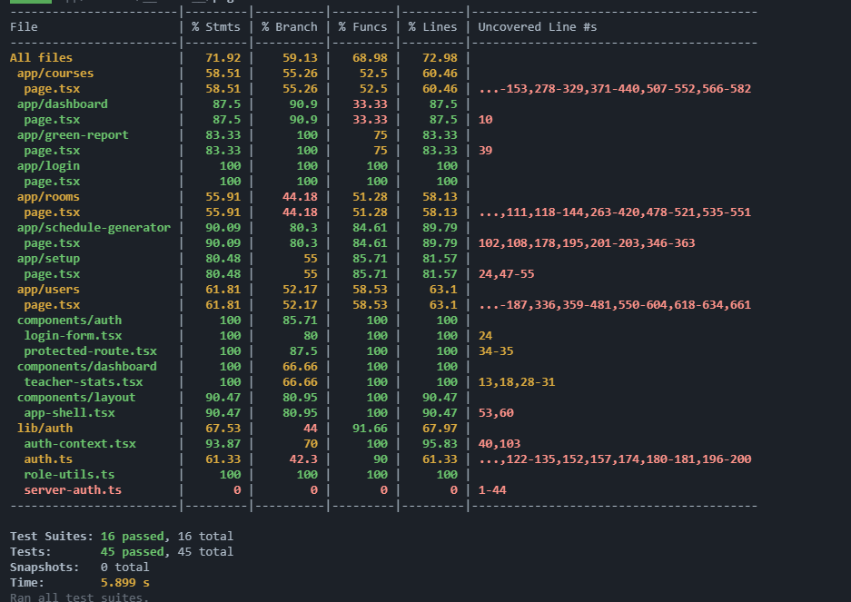
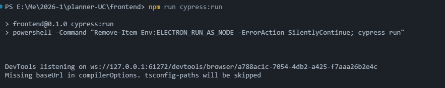
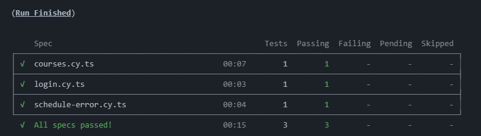
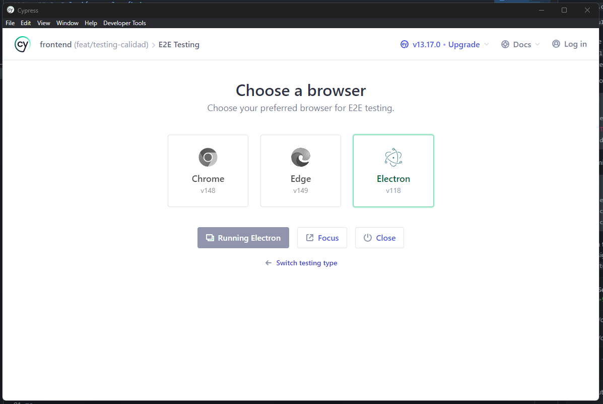
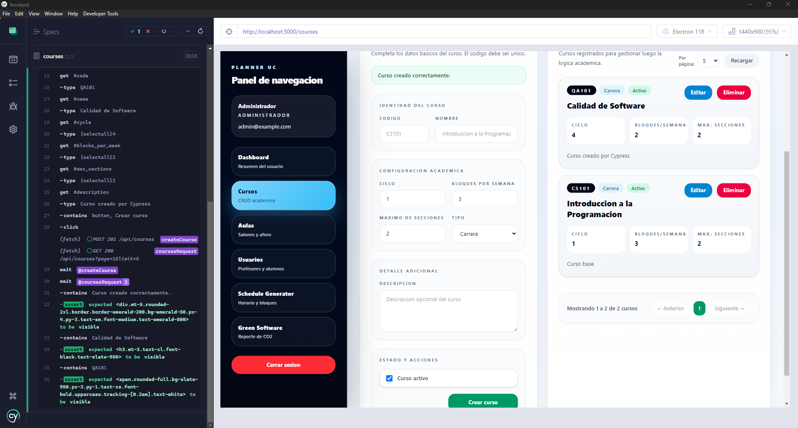

# Documento Resumen de Testing Frontend

## 1. Objetivo

Este documento resume la estrategia de pruebas implementada en el `frontend` de `Planner-UC`, los módulos cubiertos, los resultados obtenidos y la forma de ejecutar las pruebas.

El enfoque aplicado respetó la arquitectura actual del proyecto:

- `frontend`: `Next.js` + `React` + `TypeScript` + `Supabase`
- pruebas frontend con `Jest`, `React Testing Library`, `MSW` y `Cypress`

## 2. Herramientas utilizadas

Se configuraron y utilizaron las siguientes herramientas:

- `Jest` como test runner
- `React Testing Library` para pruebas de componentes y páginas
- `MSW` para simular APIs y escenarios de integración frontend
- `Cypress` para pruebas de aceptación y E2E
- `jest-dom` para aserciones de DOM
- reporte de cobertura con salida en consola, `lcov` y HTML

Archivos principales de configuración:

- [frontend/jest.config.ts](/e:/Me/2026-1/planner-UC/frontend/jest.config.ts)
- [frontend/jest.setup.ts](/e:/Me/2026-1/planner-UC/frontend/jest.setup.ts)
- [frontend/test/msw/server.ts](/e:/Me/2026-1/planner-UC/frontend/test/msw/server.ts)
- [frontend/test/msw/handlers.ts](/e:/Me/2026-1/planner-UC/frontend/test/msw/handlers.ts)

## 3. Qué se implementó

Se implementaron pruebas sobre componentes, páginas, integración frontend, flujos E2E y utilitarios de autenticación.

### 3.1 Componentes cubiertos

- `LoginForm`
- `ProtectedRoute`
- `AppShell`
- `TeacherStats`

Escenarios cubiertos:

- renderizado básico
- envío de formulario
- manejo de error
- protección por autenticación
- control por rol
- cierre de sesión
- carga de estadísticas desde API mockeada

### 3.2 Páginas cubiertas

- `app/page.tsx`
- `app/login/page.tsx`
- `app/dashboard/page.tsx`
- `app/setup/page.tsx`
- `app/green-report/page.tsx`
- `app/courses/page.tsx`
- `app/rooms/page.tsx`
- `app/users/page.tsx`
- `app/schedule-generator/page.tsx`

Escenarios cubiertos:

- redirecciones iniciales
- carga exitosa de datos
- estados vacíos
- estados de error
- formularios válidos
- cambios de vista
- filtros
- creación de registros desde UI

### 3.3 Lógica y utilitarios cubiertos

- `auth-context.tsx`
- `auth.ts`
- `role-utils.ts`

Escenarios cubiertos:

- carga de usuario actual
- login
- logout
- signup
- suscripción a cambios de autenticación
- validación de roles
- helpers de permisos

### 3.4 Flujos E2E cubiertos con Cypress

Specs implementadas:

- `cypress/e2e/login.cy.ts`
- `cypress/e2e/courses.cy.ts`
- `cypress/e2e/schedule-error.cy.ts`

Escenarios cubiertos:

- inicio de sesión con credenciales de administrador
- redirección al dashboard después del login
- acceso a módulo protegido de cursos
- creación de curso y visualización en la lista
- mensaje de error cuando falla el backend del horario
- validación de un unhappy path real del `schedule-generator`

## 4. Resultados de ejecución

Resultado de `npm test`:

- `16` test suites aprobadas
- `45` tests aprobados
- `0` fallos

Resultado de `npm run test:coverage`:

- cobertura global de statements: `71.92%`
- cobertura global de branches: `59.13%`
- cobertura global de functions: `68.98%`
- cobertura global de lines: `72.98%`

Resultado de `npm run cypress:run`:

- `3` specs ejecutadas
- `3` tests aprobados
- `0` fallos

## 5. Cobertura destacada

Los módulos con coberturas más altas en esta etapa fueron:

- `login-form.tsx`: `100%`
- `protected-route.tsx`: `100%`
- `app-shell.tsx`: `90.47%`
- `schedule-generator/page.tsx`: `90.09%`
- `auth-context.tsx`: `93.87%`
- `login/page.tsx`: `100%`
- `setup/page.tsx`: `80.48%`
- `dashboard/page.tsx`: `87.5%`

Además de las pruebas unitarias e integración, el frontend ahora cuenta con flujos automáticos de `Cypress` que validan comportamiento observable de la aplicación:

- login exitoso
- navegación protegida
- creación de curso
- respuesta visible ante error del backend

## 6. Coberturas más relevantes por módulo

- `app/schedule-generator/page.tsx`: `90.09%`
- `components/auth/login-form.tsx`: `100%`
- `components/auth/protected-route.tsx`: `100%`
- `components/layout/app-shell.tsx`: `90.47%`
- `components/dashboard/teacher-stats.tsx`: `100%`
- `app/login/page.tsx`: `100%`
- `app/dashboard/page.tsx`: `87.5%`
- `app/green-report/page.tsx`: `83.33%`
- `app/setup/page.tsx`: `80.48%`
- `app/users/page.tsx`: `61.81%`
- `app/courses/page.tsx`: `58.51%`
- `app/rooms/page.tsx`: `55.91%`

## 7. Qué quedó pendiente o más débil

Todavía existen áreas mejorables:

- `server-auth.ts` quedó sin cobertura directa (`0%`)
- `courses`, `rooms` y `users` todavía tienen cobertura media, no alta
- la cobertura de ramas (`branches`) aún está por debajo del nivel ideal

## 8. Evidencias disponibles

Comandos ejecutados:

```powershell
cd frontend
npm test
npm run test:coverage
```

```powershell
cd frontend
$env:NEXT_PUBLIC_E2E_BYPASS_AUTH='true'
npm run dev
```

```powershell
cd frontend
npm run cypress:verify
npm run cypress:run
```

Evidencias generadas:

- consola con `16` suites aprobadas
- consola con `45` tests aprobados
- reporte de cobertura en consola
- reporte HTML de cobertura
- archivo `lcov`
- consola con `3` specs E2E aprobadas
- videos de Cypress por spec
- capturas de ejecución E2E

Capturas incorporadas:

- evidencia de ejecución de pruebas: [test.png](./test.png)
- evidencia de cobertura: [coverage.png](./coverage.png)
- evidencia Cypress 1: [cypress1.png](./cypress1.png)
- evidencia Cypress 2: [cypress2.png](./cypress2.png)
- evidencia Cypress 3: [cypress3.png](./cypress3.png)
- evidencia Cypress 4: [cypress4.png](./cypress4.png)

### 8.1 Evidencia visual de ejecución



### 8.2 Evidencia visual de cobertura



### 8.3 Evidencia visual de Cypress









Ubicación de reportes:

- `frontend/coverage/lcov-report/index.html`
- `frontend/coverage/lcov.info`
- `frontend/cypress/videos`
- `frontend/cypress/screenshots`

## 9. Cómo correr todo el testing frontend

### 9.1 Unitarias e integración con Jest

```powershell
cd frontend
npm test
```

### 9.2 Cobertura

```powershell
cd frontend
npm run test:coverage
```

### 9.3 Cypress

Primero, en una terminal:

```powershell
cd frontend
$env:NEXT_PUBLIC_E2E_BYPASS_AUTH='true'
npm run dev
```

Luego, en otra terminal:

```powershell
cd frontend
npm run cypress:install
npm run cypress:verify
npm run cypress:run
```

Credenciales usadas en E2E:

- `admin@example.com`
- `password123`

## 10. Conclusión

La estrategia de testing frontend implementada permitió pasar de una cobertura muy baja a una base de pruebas mucho más sólida y reproducible.

En esta etapa se logró:

- configurar correctamente el entorno de testing
- incorporar `MSW` para integración frontend
- incorporar `Cypress` para aceptación y E2E
- validar componentes, páginas y utilitarios críticos
- validar flujos completos de login, creación de curso y error del horario
- obtener una cobertura global de `71.92%`
- dejar evidencia reproducible de ejecución, cobertura y flujos E2E

Conclusión final:

- ya existe evidencia automatizada para unitarias, integración, aceptación y E2E
- el `frontend` queda documentado con comandos claros, resultados y evidencias visuales
