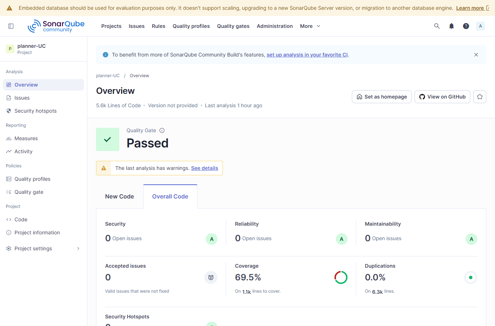
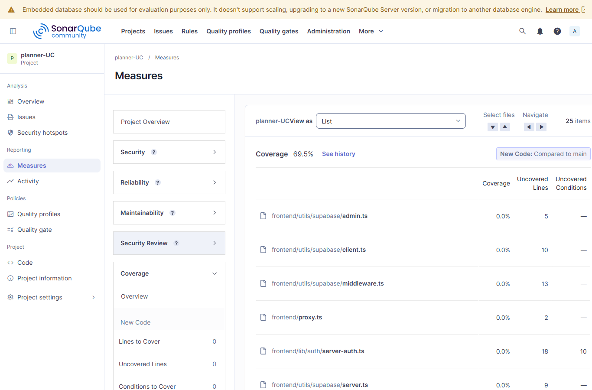
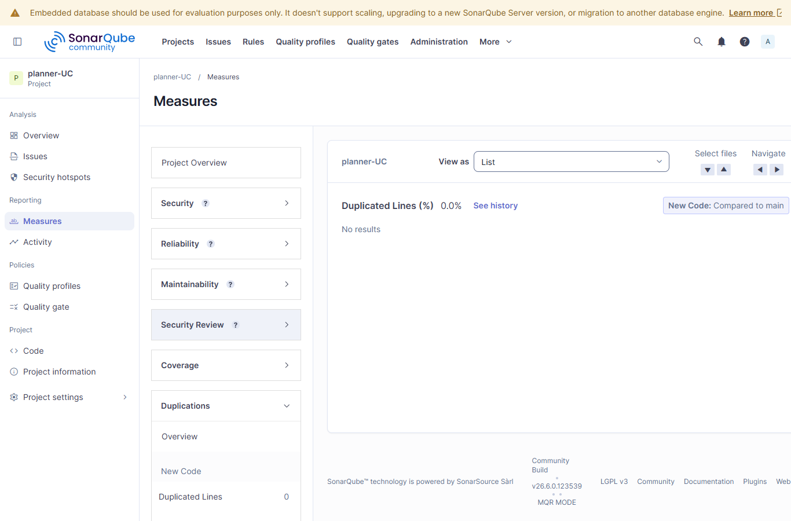
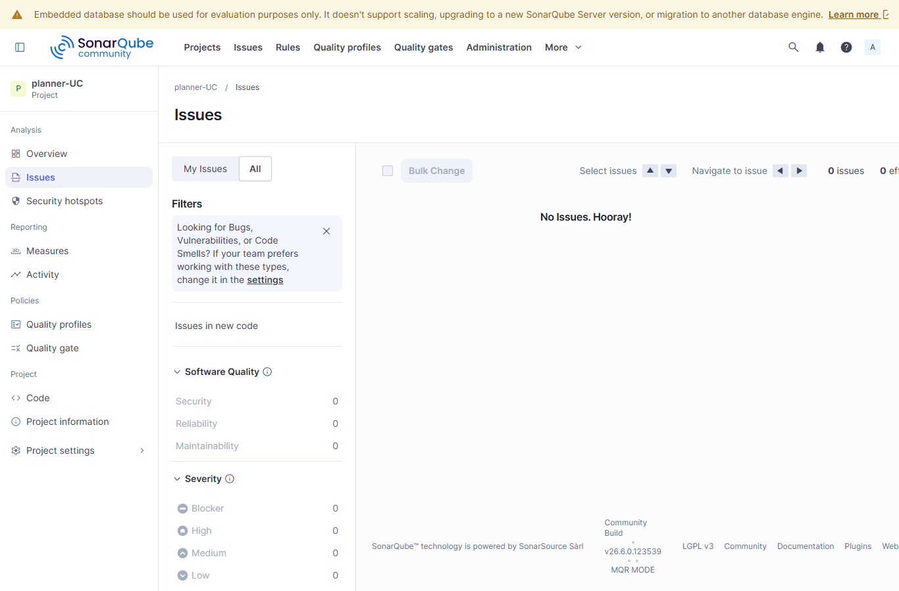

# Reporte SonarQube

## 6. Actividades Tecnicas Detalladas

## 6.1. Evaluacion de Calidad de Codigo mediante SonarQube

Este apartado responde al punto 6.1 de la consigna: configuracion de SonarQube,
analisis estatico del frontend y backend, interpretacion tecnica de metricas,
correcciones verificables y evidencias antes/despues.

### a. Configuracion

SonarQube se instalo y configuro como herramienta de analisis estatico para el
proyecto `Planner-UC`. El analisis cubre la aplicacion frontend en Next.js,
React, TypeScript y Supabase, y el backend en FastAPI, Python y OR-Tools.

| Elemento | Configuracion aplicada |
| --- | --- |
| Herramienta | SonarQube Community Build |
| Servidor | `http://localhost:9000` |
| Proyecto | `planner-UC` |
| Project Key | `NawaCruz_planner-UC_a2b871bd-c741-4d0d-bb03-9735c53c1ec8` |
| Repositorio | `https://github.com/NawaCruz/planner-UC` |
| Rama objetivo | `main` |
| Runner | GitHub Actions self-hosted en Windows X64 |
| Archivo de configuracion | `sonar-project.properties` |
| Workflow automatico | `.github/workflows/build.yml` |

La integracion con GitHub se realiza mediante GitHub Actions. El workflow
`Build` se ejecuta automaticamente en cada `push` a `main` y ejecuta el
SonarScanner contra el servidor local de SonarQube. Se usa un runner
self-hosted porque un runner hospedado por GitHub no puede acceder al
`localhost:9000` de la maquina local.

El flujo automatico realiza estos pasos:

1. Obtiene el repositorio con `fetch-depth: 0` para conservar informacion de
   blame y mejorar la trazabilidad del analisis.
2. Instala dependencias del frontend con `npm ci`.
3. Genera coverage del frontend con `npm run test:coverage -- --runInBand`.
4. Instala dependencias del backend con `uv sync`.
5. Genera coverage del backend con
   `uv run pytest --cov=app --cov-report=xml:coverage.xml`.
6. Descarga SonarScanner CLI y ejecuta el analisis.

La configuracion del scanner incluye:

| Parametro | Valor |
| --- | --- |
| `sonar.sources` | `frontend/app`, `frontend/components`, `frontend/lib`, `frontend/utils`, `frontend/types`, `frontend/proxy.ts`, `Backend/app`, `scripts` |
| `sonar.tests` | pruebas frontend, pruebas Cypress y `Backend/tests` |
| `sonar.javascript.lcov.reportPaths` | `frontend/coverage/lcov.info` |
| `sonar.python.coverage.reportPaths` | `Backend/coverage.xml` |
| `sonar.python.version` | `3.11` |
| `sonar.coverage.exclusions` | rutas API internas de Next.js, archivos de layout, pruebas y scripts auxiliares |

Esta configuracion corrige el problema anterior donde SonarQube reportaba
`0.0%` de cobertura porque el scanner no recibia archivos `lcov` ni XML de
coverage.

### b. Analisis Estatico

Se ejecuto un analisis completo del codigo fuente del frontend y backend. El
analisis actual registrado localmente en SonarQube corresponde al
`2026-06-14 20:11:45 -0500`.

| Metrica requerida | Resultado actual | Interpretacion |
| --- | ---: | --- |
| Bugs | `0` | No hay defectos clasificados como bugs. |
| Vulnerabilities | `0` | No hay vulnerabilidades abiertas. |
| Code Smells | `0` | No hay observaciones abiertas de mantenibilidad. |
| Duplicacion de codigo | `0.0%` | No se detectan bloques duplicados en el analisis actual. |
| Maintainability Rating | `A` | La deuda tecnica abierta esta controlada. |
| Reliability Rating | `A` | La ausencia de bugs mantiene la confiabilidad en nivel alto. |
| Security Rating | `A` | La seguridad mejora tras eliminar la vulnerabilidad inicial. |
| Technical Debt | `0 min` | SonarQube no reporta deuda tecnica abierta. |
| Cobertura de pruebas | `69.5%` | La cobertura ya se importa correctamente; queda como mejora subirla a 80% global. |

Metricas complementarias del analisis actual:

| Indicador | Resultado |
| --- | ---: |
| Quality Gate | `Passed` |
| Lineas de codigo | `5.6k` |
| Lineas a cubrir | `1.1k` |
| Lineas duplicadas | `0` |
| Bloques duplicados | `0` |
| Security Hotspots | `0` |
| Accepted Issues | `0` |

Componentes criticos actuales:

| Componente | Motivo tecnico | Coverage |
| --- | --- | ---: |
| `frontend/lib/auth/server-auth.ts` | Logica de autenticacion server-side sin pruebas directas. | `0.0%` |
| `frontend/utils/supabase/middleware.ts` | Helper de sesiones Supabase sin pruebas unitarias. | `0.0%` |
| `frontend/utils/supabase/client.ts` | Cliente browser Supabase sin prueba aislada. | `0.0%` |
| `frontend/utils/supabase/server.ts` | Cliente server Supabase sin prueba aislada. | `0.0%` |
| `frontend/lib/auth/auth-context.tsx` | Contexto de autenticacion con flujos aun no cubiertos. | `50.4%` |
| `frontend/app/rooms/page.tsx` | Pantalla CRUD administrativa con ramas de UI pendientes. | `53.7%` |
| `frontend/app/courses/page.tsx` | Pantalla CRUD administrativa con ramas de UI pendientes. | `61.6%` |
| `frontend/app/users/page.tsx` | Pantalla CRUD administrativa con ramas de UI pendientes. | `63.6%` |

Estos componentes ya no son criticos por bugs, vulnerabilidades, code smells o
duplicacion; el riesgo pendiente se concentra en cobertura de pruebas.

### c. Interpretacion Tecnica

La linea base del analisis mostraba problemas relevantes de seguridad,
mantenibilidad, duplicacion y trazabilidad de pruebas. El estado inicial
documentado fue:

| Metrica | Antes de correcciones |
| --- | ---: |
| Bugs | `0` |
| Vulnerabilities | `1` |
| Code Smells | `110` |
| Duplicacion de codigo | `6.1%` |
| Maintainability Rating | `A` |
| Reliability Rating | `A` |
| Security Rating | `C` |
| Technical Debt | `434 min` |
| Cobertura de pruebas en SonarQube | `0.0%` |

Los problemas detectados se justifican tecnicamente de la siguiente forma:

1. La vulnerabilidad provenia de una credencial inicial hardcodeada en codigo
   fuente. Este patron expone secretos y afecta directamente el `Security
   Rating`.
2. Los code smells se concentraban en complejidad, condicionales anidados,
   convenciones TypeScript/React y duplicacion entre pantallas CRUD.
3. La duplicacion se originaba principalmente en rutas API administrativas y
   pantallas `users`, `courses` y `rooms`, que repetian estructura de
   autenticacion, paginacion, formularios, estados y componentes visuales.
4. La cobertura aparecia en `0.0%` porque SonarQube no estaba importando los
   reportes generados por Jest ni pytest-cov.

Correcciones implementadas:

| Frente | Correccion verificable | Archivos principales |
| --- | --- | --- |
| Seguridad | Se elimino la credencial hardcodeada y se movio la configuracion inicial a variables de entorno. | `frontend/app/api/setup/route.ts`, `frontend/README.md` |
| Mantenibilidad backend | Se redujo complejidad en helpers y flujo del solver sin cambiar el contrato del endpoint. | `Backend/app/scheduling_demo.py`, `Backend/app/scheduling_demo_data.py` |
| Mantenibilidad frontend | Se corrigieron patrones TypeScript/React reportados por SonarQube. | `frontend/app/**`, `frontend/lib/auth/**`, `frontend/components/**` |
| Duplicacion API | Se extrajeron helpers comunes para admin, paginacion, errores y codigos de mutacion. | `frontend/app/api/_shared/admin-mutations.ts` |
| Duplicacion CRUD | Se extrajeron componentes y estado reutilizable para pantallas administrativas. | `frontend/components/admin/crud-ui.tsx` |
| Validacion de payloads | Se separo normalizacion de cursos y aulas en modulos especificos. | `frontend/app/api/courses/course-payload.ts`, `frontend/app/api/rooms/room-payload.ts` |
| Coverage | Se agrego importacion de `lcov.info` y `coverage.xml` al scanner y generacion previa en CI. | `sonar-project.properties`, `.github/workflows/build.yml` |

La mejora mas importante es que el analisis actual queda sin issues abiertos y
sin duplicacion. El coverage ya no es `0.0%`; ahora se reporta `69.5%` con
datos reales. Aun asi, la cobertura global queda por debajo de un objetivo
tecnico recomendable de `80%`, por lo que se propone ampliar pruebas en:

1. helpers Supabase (`client`, `server`, `middleware`, `admin`),
2. `server-auth.ts`,
3. ramas de error y exito de los CRUD administrativos,
4. flujos de paginacion y edicion en `users`, `courses` y `rooms`.

### d. Evidencias Obligatorias

#### 1. Capturas de dashboard

Las capturas fueron generadas desde el SonarQube local autenticado y se
almacenan en `docs/evidencias/sonarqube/`.

| Evidencia | Archivo |
| --- | --- |
| Dashboard principal | `docs/evidencias/sonarqube/dashboard.png` |
| Quality Gate y Overall Code | `docs/evidencias/sonarqube/quality-gate-overall.png` |
| Medidas de coverage | `docs/evidencias/sonarqube/coverage-measures.png` |
| Medidas de duplicacion | `docs/evidencias/sonarqube/duplication-measures.png` |
| Issues abiertos | `docs/evidencias/sonarqube/issues-open.png` |

#### 2. Metricas antes y despues de correcciones

| Metrica | Antes | Despues | Resultado |
| --- | ---: | ---: | --- |
| Bugs | `0` | `0` | Se mantiene sin bugs abiertos. |
| Vulnerabilities | `1` | `0` | Vulnerabilidad eliminada. |
| Code Smells | `110` | `0` | Observaciones de mantenibilidad corregidas. |
| Duplicacion de codigo | `6.1%` | `0.0%` | Duplicacion eliminada. |
| Maintainability Rating | `A` | `A` | Se mantiene en nivel alto. |
| Reliability Rating | `A` | `A` | Se mantiene en nivel alto. |
| Security Rating | `C` | `A` | Mejora por eliminacion de vulnerabilidad. |
| Technical Debt | `434 min` | `0 min` | Deuda tecnica abierta reducida. |
| Cobertura de pruebas | `0.0%` | `69.5%` | Coverage importado correctamente en SonarQube. |

#### 3. Reporte tecnico de analisis

El analisis SonarQube confirma que `Planner-UC` cumple actualmente el Quality
Gate configurado. La aplicacion no presenta bugs, vulnerabilidades, code smells,
security hotspots ni duplicacion de codigo abierta. Las correcciones realizadas
mantienen la arquitectura definida del proyecto: frontend para autenticacion y
gestion administrativa con Supabase, backend para resolucion de horarios con
FastAPI y OR-Tools.

La principal mejora pendiente es ampliar cobertura automatizada. Aunque el
problema de `0.0%` fue corregido mediante configuracion del scanner y generacion
de reportes, el valor global de `69.5%` indica que existen modulos relevantes
sin pruebas directas, especialmente autenticacion server-side, helpers Supabase
y ramas de UI administrativa.

#### 4. Evidencia de reduccion de deuda tecnica

| Indicador | Antes | Despues | Evidencia |
| --- | ---: | ---: | --- |
| Issues abiertos | `111` | `0` | Vista `issues-open.png` sin issues. |
| Vulnerabilidades | `1` | `0` | `Security Rating` mejora de `C` a `A`. |
| Code Smells | `110` | `0` | `Maintainability Rating` queda en `A`. |
| Deuda tecnica | `434 min` | `0 min` | SonarQube no reporta deuda abierta. |
| Duplicacion | `6.1%` | `0.0%` | Vista `duplication-measures.png` sin resultados duplicados. |
| Coverage reportado | `0.0%` | `69.5%` | Vista `coverage-measures.png` con reportes importados. |

## Pendiente

Los puntos `6.2`, `6.3`, `6.4` y `6.5` deben desarrollarse en secciones
separadas para OWASP Top 10 2025, WCAG, SUS y testing automatizado.
