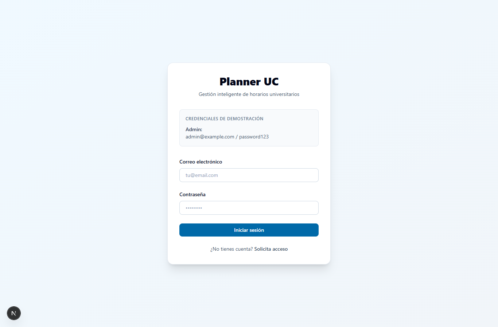
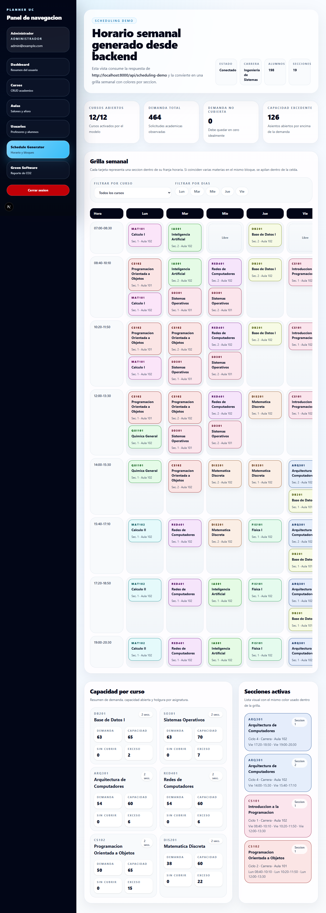
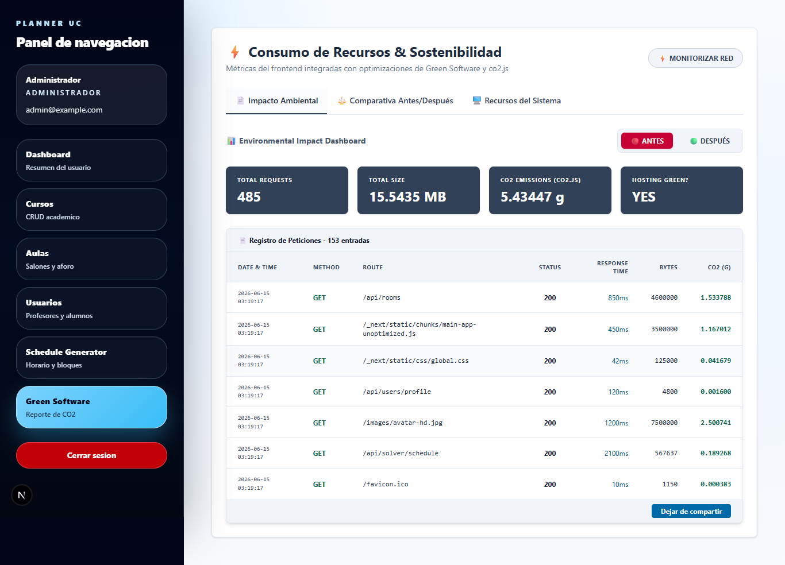

# Reporte WCAG

## 6. Actividades Tecnicas Detalladas

## 6.3. Evaluacion de Accesibilidad mediante WCAG

Este apartado documenta la evaluacion de accesibilidad aplicada a `Planner-UC`
segun el punto 6.3 de la consigna. La revision cubre contraste, navegacion por
teclado, estructura semantica, etiquetas, compatibilidad con lectores de
pantalla, formularios, multimedia y accesibilidad funcional.

### a. Alcance Evaluado

Se evaluaron rutas publicas y rutas internas autenticadas con el perfil
administrador de demostracion.

| Tipo | Rutas evaluadas |
| --- | --- |
| Publicas | `/login`, `/setup` |
| Autenticadas | `/dashboard`, `/courses`, `/rooms`, `/users`, `/schedule-generator`, `/green-report` |

### b. Herramientas Utilizadas

| Herramienta requerida | Aplicacion en el proyecto | Evidencia |
| --- | --- | --- |
| Herramientas automaticas | `axe-core` ejecutado sobre WCAG 2.0/2.1 A y AA. | `docs/evidencias/wcag/final/axe-final.json` |
| Validacion manual | Recorrido por teclado con `Tab`, revision de foco y orden operativo. | `docs/evidencias/wcag/final/keyboard-final.json` |
| Inspeccion del DOM | Conteo de landmarks, `h1`, controles sin etiqueta, acciones sin nombre accesible y `aria-current`. | `docs/evidencias/wcag/final/summary.json` |
| Validadores de accesibilidad | Validacion automatizada Axe en navegador Edge headless. | Capturas en `docs/evidencias/wcag/final/` |

### c. Evaluaciones Obligatorias

| Evaluacion | Resultado final | Evidencia tecnica |
| --- | --- | --- |
| Contraste de colores | Cumple. Axe reporta `0` violaciones finales. | `axe-final.json` |
| Navegacion mediante teclado | Cumple. Login, sidebar, filtros, tabs y regiones scrollables reciben foco. | `keyboard-final.json` |
| Estructura semantica HTML | Cumple. Cada ruta evaluada tiene `main: 1` y un `h1` principal. | `summary.json` |
| Uso correcto de etiquetas | Cumple. `unnamedControls: 0` en todas las rutas evaluadas. | `summary.json` |
| Compatibilidad con lectores de pantalla | Cumple a nivel funcional: `aria-current`, `role=tab`, `role=region`, `role=alert` y `role=status` donde aplica. | Inspeccion DOM |
| Accesibilidad de formularios | Cumple. Login, setup y formularios CRUD mantienen labels y estados visibles. | `summary.json` |
| Accesibilidad multimedia | No aplica para audio/video. Las imagenes existentes conservan texto alternativo. | Revision manual |
| Accesibilidad funcional | Cumple. Filtros, tabs, paginacion, tablas y regiones desplazables son operables o legibles. | `keyboard-final.json` |

### d. Linea Base de Incumplimientos

La primera ejecucion automatica detecto incumplimientos principalmente de
contraste y acceso por teclado a regiones desplazables.

| Incumplimiento | Criterio WCAG relacionado | Componente afectado | Correccion aplicada |
| --- | --- | --- | --- |
| Boton `Cerrar sesion` con contraste insuficiente. | 1.4.3 Contraste minimo | `components/layout/app-shell.tsx` | Se cambio de rojo claro a `bg-red-700` y se agrego foco visible. |
| Botones administrativos con contraste insuficiente. | 1.4.3 Contraste minimo | `courses`, `rooms`, `users`, `login`, `setup` | Se usaron tonos `sky-700`, `emerald-700` y estados `focus-visible`. |
| Etiquetas de cursos en horario con contraste limite. | 1.4.3 Contraste minimo | `schedule-generator/page.tsx` | Se oscurecio el color de acento generado por `slotColor`. |
| Grilla y lista desplazable sin acceso por teclado. | 2.1.1 Teclado | `schedule-generator/page.tsx` | Se agrego `tabIndex=0`, `role=region` y `aria-label`. |
| Pantallas internas sin landmark principal uniforme. | 1.3.1 Informacion y relaciones | `app-shell`, pantallas admin | Se centralizo `<main id="main-content">` en `AppShell`. |
| Multiples `h1` por titulo del sidebar. | 1.3.1 Informacion y relaciones | `app-shell` | El titulo visual del sidebar dejo de ser `h1`. |
| Tabs y tabla del Green Report con contraste insuficiente. | 1.4.3 Contraste minimo | `green-report/page.tsx` | Se ajustaron colores, roles de tabs y tabla con superficie clara. |
| Tabla desplazable sin contexto accesible. | 1.3.1 / 2.1.1 | `green-report/page.tsx` | Se agrego `caption`, `role=region`, `aria-label` y foco visible. |

### e. Correcciones Implementadas

| Archivo | Mejora implementada |
| --- | --- |
| `frontend/components/layout/app-shell.tsx` | Skip link, `main` compartido, `aria-current`, `aria-label` en navegacion, foco visible y contraste corregido. |
| `frontend/app/dashboard/page.tsx` | Eliminacion de `main` anidado y uso de `h1` como titulo real de pagina. |
| `frontend/app/login/page.tsx` | Landmark `main` en pantalla publica. |
| `frontend/app/setup/page.tsx` | Landmark `main`, estados `role=status`/`role=alert`, contraste y foco de boton. |
| `frontend/components/auth/login-form.tsx` | Error con `role=alert`, contraste y foco del boton principal. |
| `frontend/app/courses/page.tsx` | Contraste y foco en botones principales y paginacion activa. |
| `frontend/app/rooms/page.tsx` | Contraste y foco en botones de accion. |
| `frontend/app/users/page.tsx` | Contraste y foco en botones de accion. |
| `frontend/app/schedule-generator/page.tsx` | Colores de tarjetas, regiones desplazables accesibles y texto `Libre` con mayor contraste. |
| `frontend/app/green-report/page.tsx` | Tabs con roles ARIA, tabla con caption, region desplazable, contraste AA y botones con foco visible. |

### f. Resultados Antes y Despues

| Indicador | Antes | Despues |
| --- | ---: | ---: |
| Rutas evaluadas | `8` | `8` |
| Violaciones Axe acumuladas | `8` | `0` |
| Tipos de violacion | `color-contrast`, `scrollable-region-focusable` | Ninguno |
| Controles sin etiqueta | `0` | `0` |
| Acciones sin nombre accesible | `0` | `0` |
| Rutas con `main` unico | Parcial | `8/8` |
| Rutas con `h1` principal | Parcial | `8/8` |
| Regiones scrollables operables por teclado | Parcial | Cumple |

Resumen final por ruta:

| Ruta | Violaciones Axe finales | `main` | `h1` | Controles sin etiqueta |
| --- | ---: | ---: | --- | ---: |
| `/login` | `0` | `1` | `Planner UC` | `0` |
| `/setup` | `0` | `1` | `Configuracion Inicial` | `0` |
| `/dashboard` | `0` | `1` | `Bienvenido, Administrador!` | `0` |
| `/courses` | `0` | `1` | `Cursos de universidad` | `0` |
| `/rooms` | `0` | `1` | `Aulas y aforo` | `0` |
| `/users` | `0` | `1` | `Profesores y alumnos` | `0` |
| `/schedule-generator` | `0` | `1` | `Horario semanal generado desde backend` | `0` |
| `/green-report` | `0` | `1` | `Consumo de Recursos & Sostenibilidad` | `0` |

### g. Checklist WCAG

| Criterio | Estado | Sustento |
| --- | --- | --- |
| 1.1.1 Contenido no textual | Cumple | Imagenes con `alt`; no se detectan acciones sin nombre. |
| 1.3.1 Informacion y relaciones | Cumple | `main`, `nav`, `aside`, `h1`, labels y captions declarados. |
| 1.4.3 Contraste minimo | Cumple | Axe final sin `color-contrast`. |
| 2.1.1 Teclado | Cumple | Secuencia de foco documentada y regiones scrollables con foco. |
| 2.4.1 Evitar bloques | Cumple | Skip link al contenido principal. |
| 2.4.3 Orden del foco | Cumple | Login, sidebar, filtros y grillas siguen orden operativo. |
| 2.4.4 Proposito de enlaces | Cumple | Enlaces y botones mantienen texto visible. |
| 2.4.6 Encabezados y etiquetas | Cumple | Un `h1` por vista y labels en formularios. |
| 3.3.1 Identificacion de errores | Cumple | Errores de login/setup usan `role=alert`. |
| 4.1.2 Nombre, funcion, valor | Cumple | Tabs, regiones y enlace activo tienen roles/estados accesibles. |

### h. Evidencias Obligatorias

| Evidencia requerida | Archivo |
| --- | --- |
| Reporte automatico antes | `docs/evidencias/wcag/baseline/axe-baseline.json` |
| Resumen automatico antes | `docs/evidencias/wcag/baseline/summary.json` |
| Reporte automatico despues | `docs/evidencias/wcag/final/axe-final.json` |
| Resumen automatico despues | `docs/evidencias/wcag/final/summary.json` |
| Validacion por teclado | `docs/evidencias/wcag/final/keyboard-final.json` |
| Capturas de validacion | `docs/evidencias/wcag/final/*.png` |
| Listado de incumplimientos | Tabla de la seccion `d` |
| Evidencia de correcciones | Tabla de la seccion `e` |

Capturas principales:

### i. Conclusion Tecnica

Luego de las correcciones, las rutas evaluadas de `Planner-UC` no presentan
violaciones automaticas WCAG A/AA segun Axe. La aplicacion mejora su estructura
semantica, contraste, navegacion por teclado y compatibilidad con lectores de
pantalla sin alterar la separacion arquitectonica del sistema.

Como mejora futura, se recomienda integrar una auditoria Axe en CI para evitar
regresiones de accesibilidad en nuevas pantallas o componentes.
